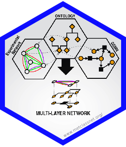

# Stickers for MetClassNet related things

This repository contains stickers for MetClassNet sub-projects, packages and people.

## Project Stickers:

## People Stickers:

<!--  -->

## Stickers for *events*

Stickers for some upcoming events.

# Sticker development guidelines

This repo was inspired (well, modified) from https://github.com/Bioconductor/BiocStickers.

To start with a new sticker you might want to use one of the templates
([gimp_template.xcf](template/gimp_template.xcf) (gimp format) or
[inkscape_template.svg](template/inkscape_template.svg) (Inkscape format)) or
you might want to look at the
[`hexSticker`](https://github.com/GuangchuangYu/hexSticker) package to produce
the sticker entirely in `R`.

You can also find a tutorial [Sticker_instructions.png](Tutorial/Sticker_instructions.png)
to design your stickers manually in `Illustrator`.

+ Each sticker should be put into a folder named according to the package.
+ Each folder should also contain a *README.md* providing at least the name of
  the package and the designer/maintainer of the sticker (which is not
  necessarily the maintainer of the package).
+ The height of the final png should be 5cm, resolution should be at least
  300dpi.
+ While it is not mandatory, it is suggested to use the *Aller* font for the
  text (available in folder *fonts/Aller*.
+ Ideally, the position of the package name text (bottom line) should be 18mm
  from the top of the image.
+ Some suggestions for color definitions:
  http://www.flatuicolorpicker.com/category/all .

# Potential printing outlets

Someone mentioned to us you can print them via https://www.stickermule.com/eu as "Custom stickers" -> "Die cut stickers" size 50mm x 50mm.

# License

Except where otherwise stated, the content and the stickers in this
repository are licensed under the Creative Commons CC0 1.0 Universal License.

See also 
